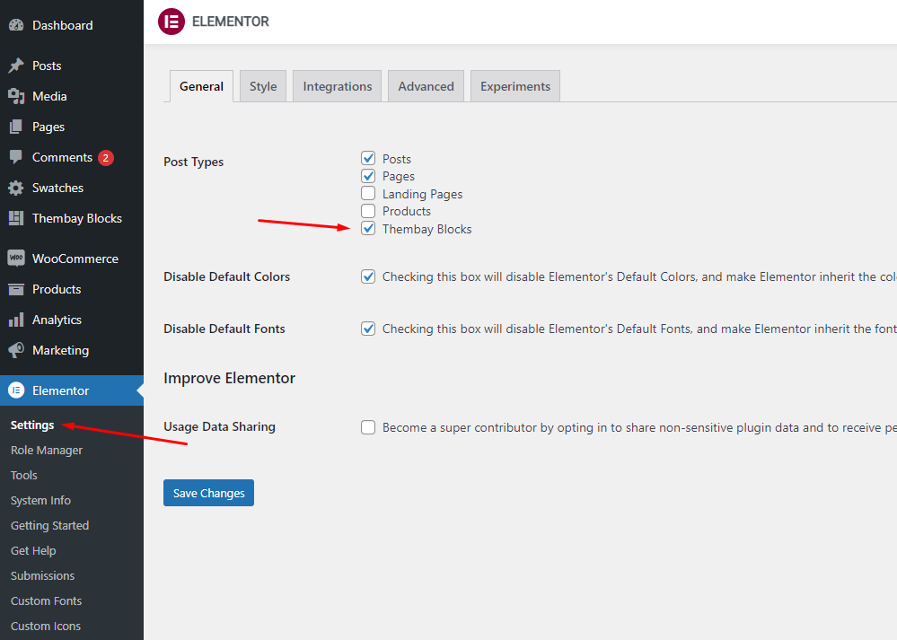
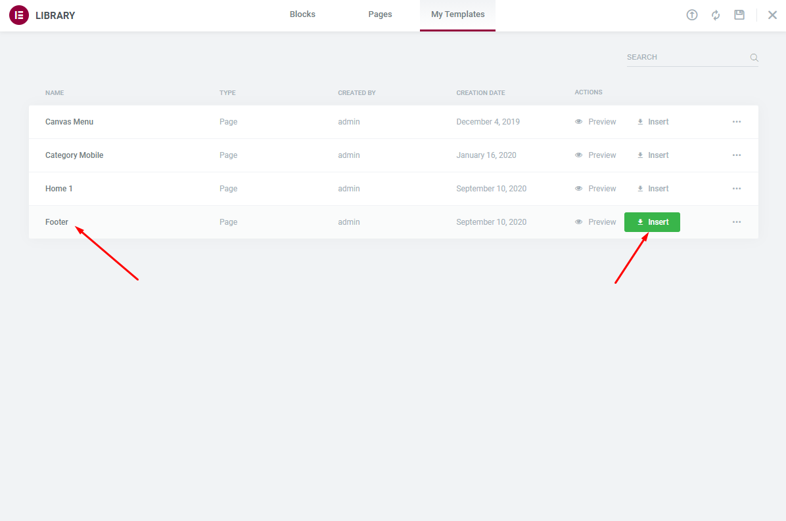

# Create a Footer

#### Create a Footer with the template we provide. 


**You need Enable Elementor for Thembay Blocks, then edit Footer with Elementor**


* **Step 1** Enable Elementor for Thembay Blocks.

* **Step 2** Choose Thembay Blocks > Add New > Type of Template = Footer.

* **Step 3** - Build your header style with an unlimited layout.

* **Step 4** Choose **Sample Data** > **footer** > **template-footer-xxx.json**.

* **Step 5** **Select Footer default in Theme Options**.

