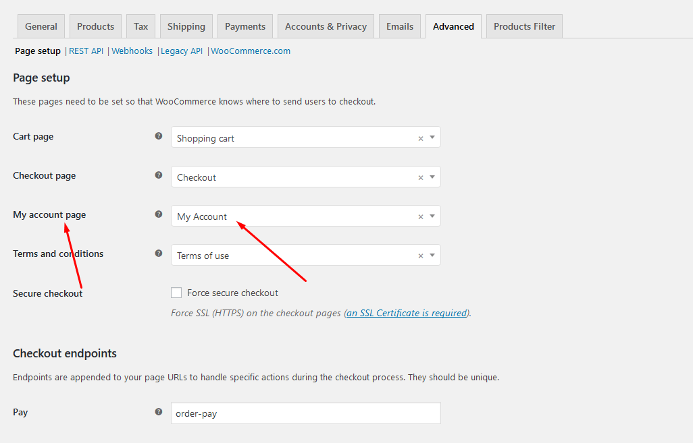

# Enable the Registration Form

#### How To Enable the Registration Form on the ‘Login/My Account’ page? 

In case you cannot see the Registration Form on the My Account page or checkout page, it means you need to enable it.

You can find this setting by navigating to **WooCommerce** >> **Settings**.

Open **Account** Tab In the **Registration** section, make sure the" **Enable registration on the "Checkout" page**" and  “**Enable registration on the “My Account” page**” options are checked.

This is what you should be seeing on your screen:

