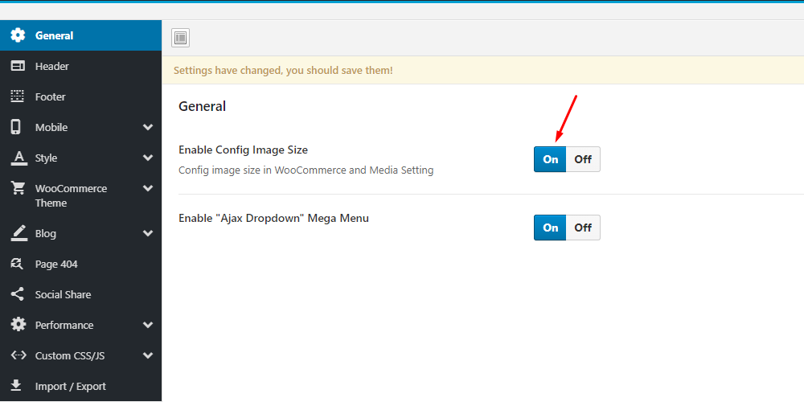
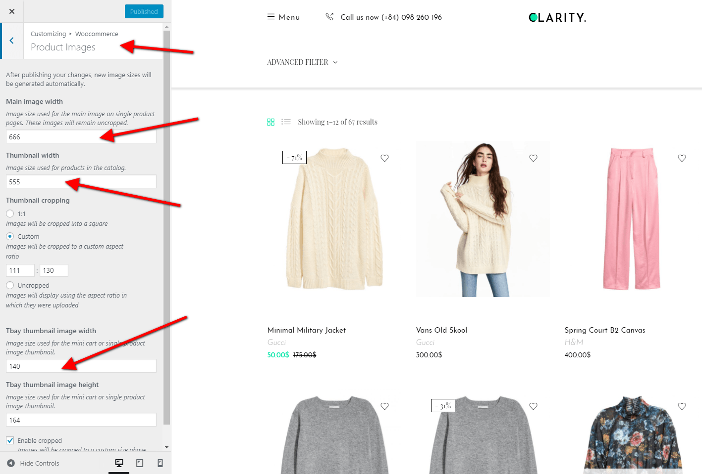
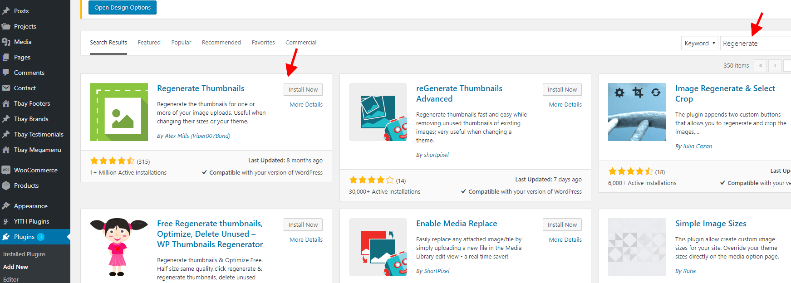
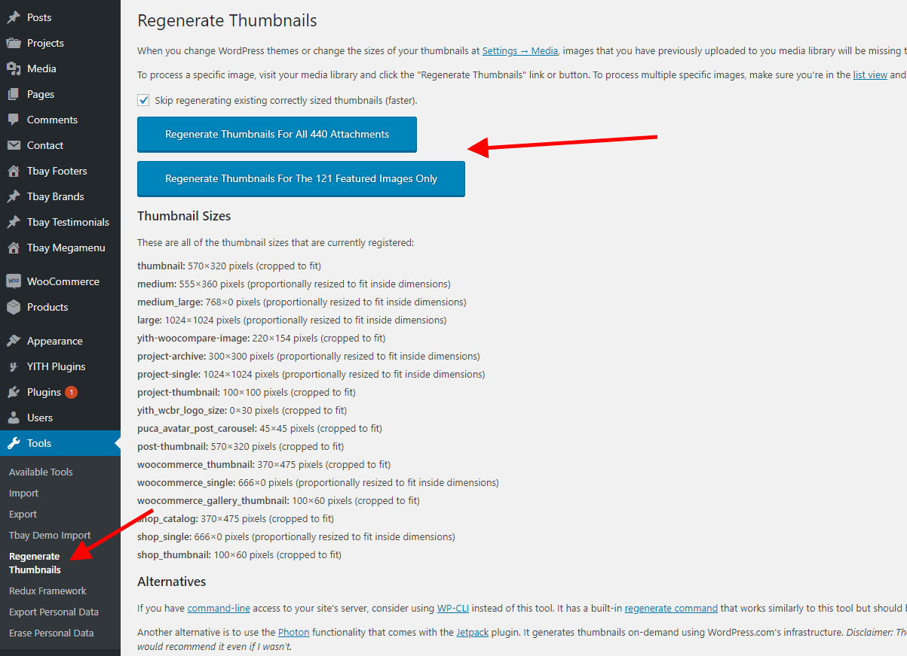

# Product's image size?

#### Follow the steps below to edit the image size:

### <mark style="color:purple;">**1. Turn On "Enable Config Image Size" in Theme Options**</mark>

**Then config in WooCommerce Customize:**

### <mark style="color:purple;">**2. Regenerate Thumbnails with the "Regenerate Thumbnails" plugin.**</mark>

