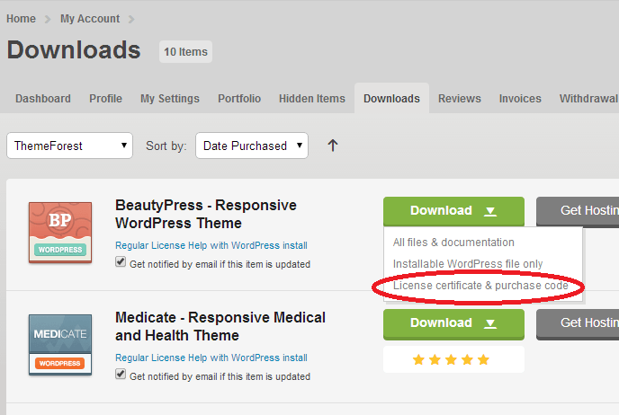
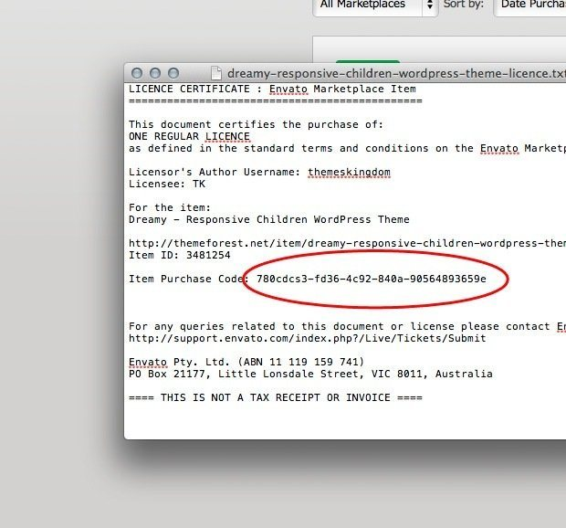

# Free Support

All of our items come with **free support**, and we have an advanced ticket system to handle your requests. Support is limited to questions regarding the theme’s features or problems with the theme. We are not able to provide support for code customizations or third-party plugins. If you need help with anything other than minor customizations of your theme, we suggest enlisting the help of a developer.

### **How To Receive Free Support**

* **Step 1** – Go to **Ticket System** [(https://tickets.thembay.com/)](https://tickets.thembay.com) and Click **Submit a ticket**.
* **Step 2** – Provide all required information: **Product Name**, **Purchase Code**, **your username on Themeforest.net** and **URL to your page** to verify your license.
* **Step 3** – Provide more details about the problem, describe, screenshot ...
* **Step 4** – Submit a ticket and wait **for** our response **(within 14-24 hours)**

### **How to find your ThemeForest Item Purchase Code**

To find your license key/purchase code you need to log into your ThemeForest account and go to your [Downloads](https://themeforest.net/downloads) page.\
Locate some of the Themes Kingdom themes you purchased in your [Downloads](https://themeforest.net/downloads) list and click on the Download and next on the **License Certificate & purchase code** link in the drop-down menu.\
After you have downloaded the certificate you can open it in a text editor such as Notepad and copy the **Item Purchase Code**.\

