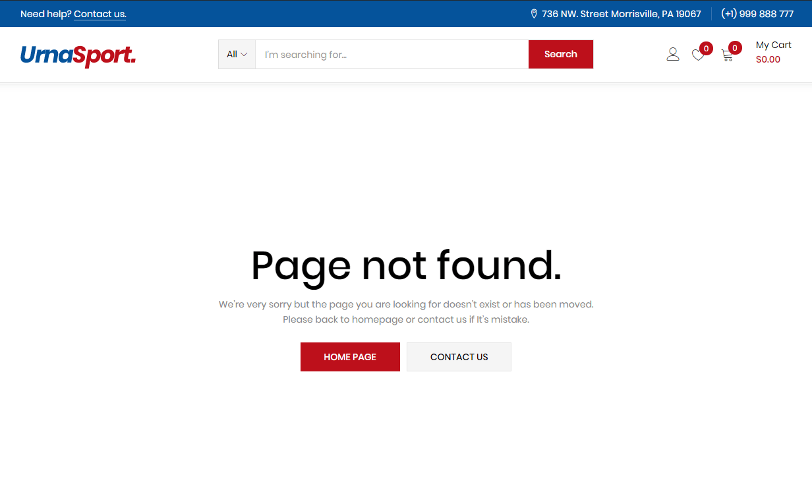

# Error or Problem


For best performance, we recommend using PHP 7.2 or higher. Most people have problems when PHP < 7


* [x] **1. Page not found**


**In this case, you only need to import the data again.**


* [x] **2. Other issues**


If you have problems importing the demo ( example: infinite loading, error 505 with when using WordPress importer ) then you may have a problem with the server settings. Please check these:


1. If the import stalls and fails to respond after a few minutes, or it fails with a simple error message like “Import failed,” You are suffering from PHP configuration limits that are set too low to complete the process. You should contact your web host and ask them to increase those limits to a minimum as follows:\

   * max\_execution\_time 3600
   * max\_input\_time 3600
   * memory\_limit 256M
   * post\_max\_size 64M
   * upload\_max\_filesize 64M
   * max\_input\_vars 3000
   * **allow\_url\_fopen on** (!important)
   * Please install the XMLReader PHP extension on your server

You can verify your PHP configuration limits by installing a simple plugin found [here](http://wordpress.org/extend/plugins/wordpress-php-info/). And you can also check your PHP error logs to see the exact error being returned.

2\. Also if possible update your **PHP version to 7.2**

\
3\. Save all config in Woocommerce before importing data

After doing this you can reset your database using the [WordPress Database Reset](https://wordpress.org/plugins/wordpress-database-reset/) Plugin and try to re-import the demo data ( **WARNING**: Reset the database will make you lose all the data of your current WordPress )\
\
If you still have a problem **your web host may use process watching software that prevents bulk processing on their web servers.**

If you have a problem please submit a ticket and we will help you to import the demo.
