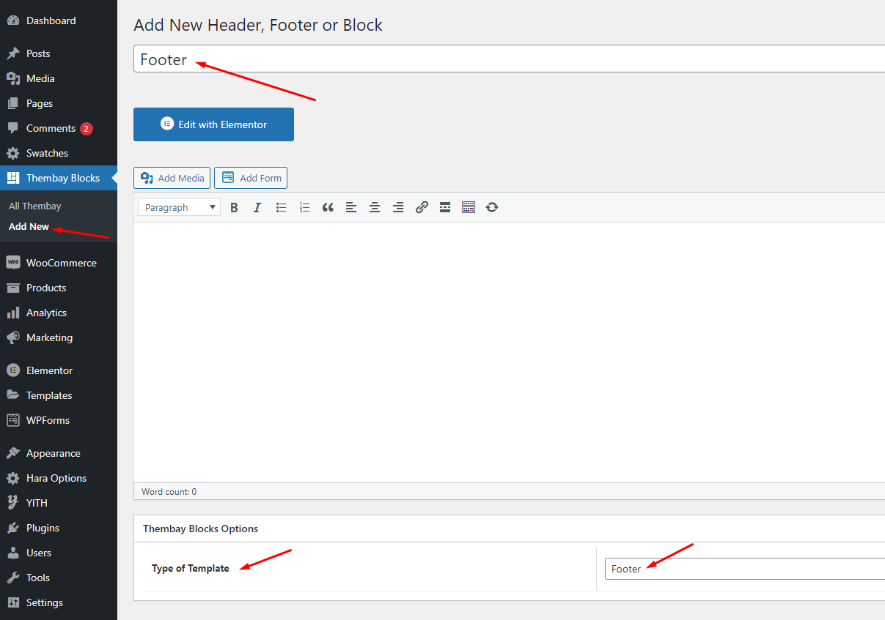
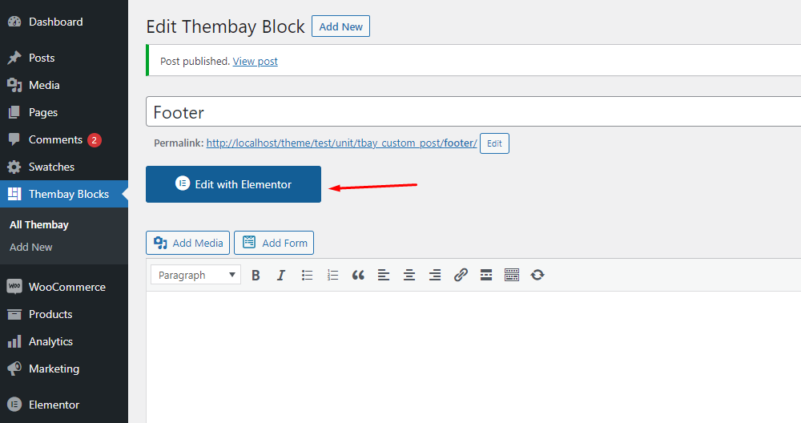
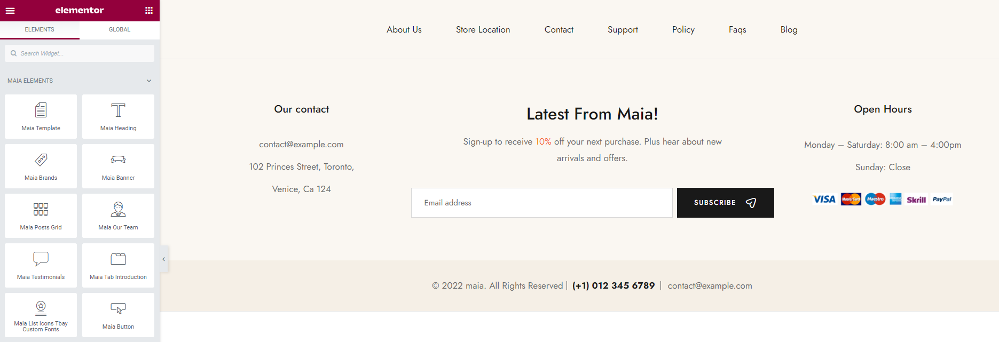

# Import All Sample Data and import the configure for the website available.


If you have a website with data available, follow these steps to use the "Maia" theme for your website.


* [x] Step 1 - Install and activate the theme.
* [x] Step 2 - **Deactivate** and **Delete** the plugins "**Urna Core**", "**Tbay Framework Pro**", "**Tbay Framework**" (If they exist in your old Theme)

* [x] Step 3 - Install and activate the required plugins.
* [x] Step 4 - Go to **Appearance** > **Theme Setup** > **Click to Start**

* [x] Step 5 - **Install Child Theme**

.png>)

* [x] Step 6 - **Import Content**: Select the **Demo you want (Uncheck the content section)**, then click on **Import**

**The process may take some time. Please wait**

****:tada:**All done. Have fun!**

* [x] <mark style="background-color:purple;">**Step 7 (Important Step)**</mark> - **Regenerate CSS** for **Elementor**: Styles set in Elementor are saved in CSS files in the uploads folder. Recreate those files, according to the most recent settings.

* [x] Step 8 - Elementor Settings: Enable Elementor for Thembay Blocks. Disable Default Colors, Disable Default Fonts.

.png>)

* [x] Step 9 - Create a **Home Page** with the template we provide

Choose **Sample Data** > **pages** > **template-home-xxx.json**

**Turn Off Breadcrumb on Homepage**

**Choose homepage displays**

* [x] Step 10 - Create a **Footer** with the template we provide

Choose **Thembay Blocks** > **Add New** > **Type of Template = Footer**

Choose **Sample Data** > **footer** > **template-footer-xxx.json**

**Select Footer default in Theme Options**

