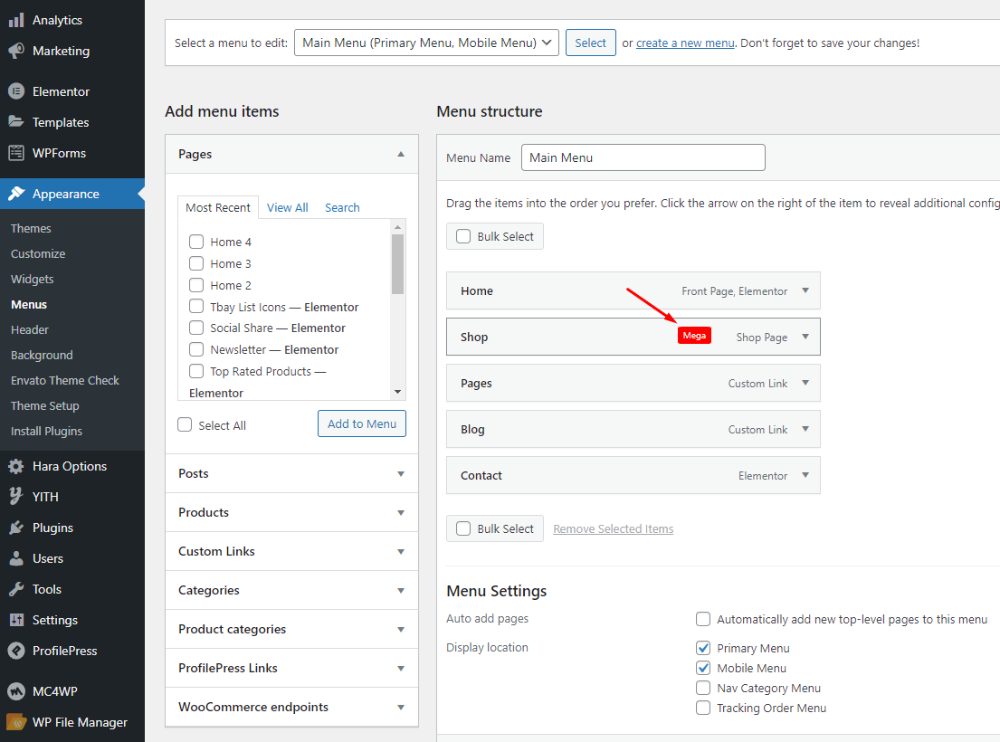
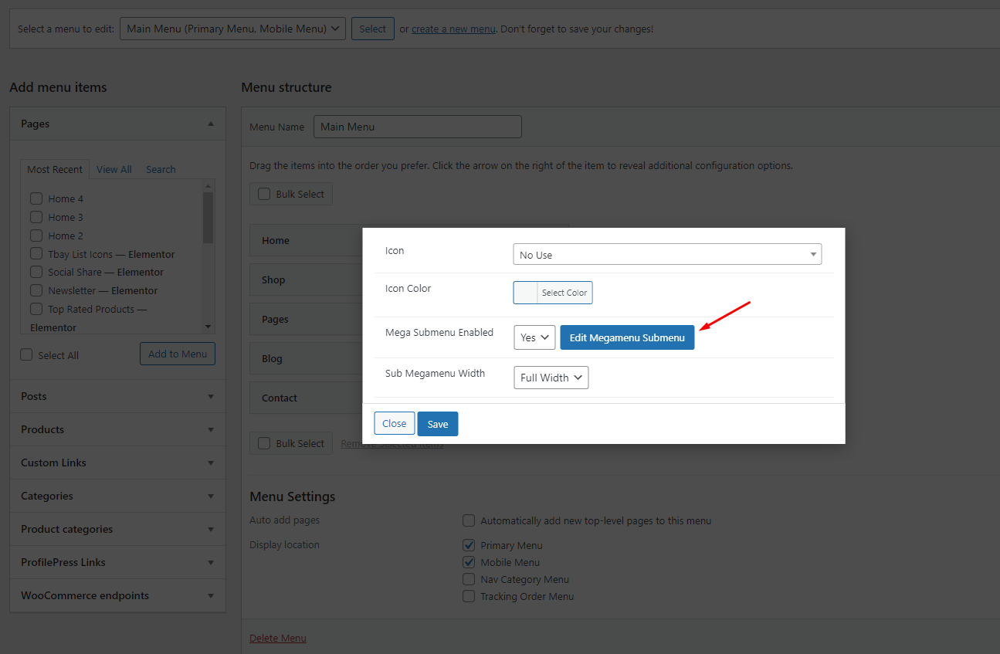

# For a new website

* [x] <mark style="color:purple;">**Step 1**</mark> - Login to your **WordPress Dashboard**.
* [x] <mark style="color:purple;">**Step 2**</mark> - Go to **Appearance** > **Theme Setup** > **Click to Start**

.png>)

* [x] <mark style="color:purple;">**Step 3**</mark> - **Install Child Theme**

* [x] <mark style="color:purple;">**Step 4**</mark> - **Import Content**: Select the **Demo you want**, then click on **Import**

**The process may take some time. Please wait**

****:tada:**All done. Have fun!**

* [x] <mark style="color:purple;">**Step 5**</mark> - Save information on **** all products (**fix errors not showing Categories, products**)

<!---->

* **5.1 "Quick Edit" any product.**

* **5.2 Check all categories, then click Update**

* [x] <mark style="background-color:purple;">**Step 6 (Important Step)**</mark> - **Regenerate CSS** for **Elementor**: Styles set in Elementor are saved in CSS files in the uploads folder. Recreate those files, according to the most recent settings.

* [x] <mark style="color:purple;">**Step 7**</mark> - Elementor Settings: Enable Elementor for Thembay Blocks. Disable Default Colors, Disable Default Fonts.

* [x] <mark style="color:purple;">**Step 8**</mark> - Replace URL: Enter your old and new URLs for your WordPress installation, to update all Elementor data.

* **Old Url**: That is our demo link, eg: **https://el3.thembaydev.com/maia/**
* **New Url**: Your website's link

* [x] <mark style="color:purple;">**Step 9**</mark> - Choose Shop Page: Go to **WooCommerce** > **Settings** > **Products** > **General** > **Shop Page**


When you install the WooCommerce plugin, your website will automatically create a Shop page. Therefore, when importing Maia data, it will have two Shop pages. You need to delete a page. Please follow this video:




* [x] <mark style="color:purple;">**Step 10**</mark> - Choose Cart and Checkout Page: Go to **WooCommerce** > **Settings** > **Advanced**

* [x] <mark style="color:purple;">**Step 11**</mark> - Configure Mega Menu

#### Please follow this video:



* [x] <mark style="color:purple;">**Step 12**</mark> - Configure the Product Attributes

You need to match the types of attributes, eg: Color => Type = Color

