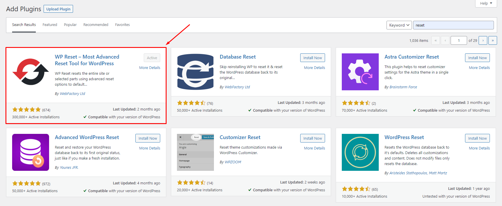
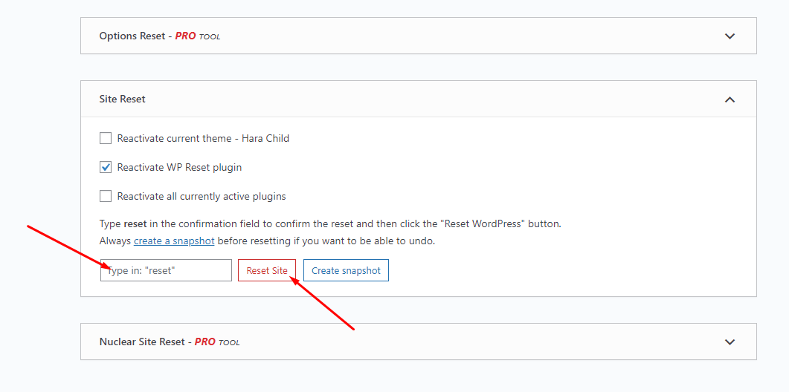

# Reset Data


Each Maia's skin uses separate data, so if you want to switch between skins you need to reset the data, then import the data again.\
Use this plugin to reset the WordPress database: [https://wordpress.org/plugins/wp-reset/](https://wordpress.org/plugins/wordpress-reset/)


**Follow these steps:**

* [x] <mark style="color:purple;">**Step 1**</mark> - Install the **WP Reset** plugin.

* [x] <mark style="color:purple;">**Step 2**</mark> - Reset Database

* [x] <mark style="color:purple;">**Step 3**</mark> - Configure the **Theme Setup** as instructed above
