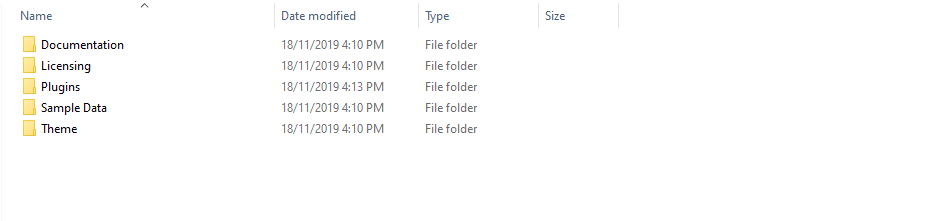

# Extract Package


**After the download is completed, you need to unzip the package and select the way you want to install the theme.**


### Once the download is complete, unzip the file and you would see the following packages:

* [x] **Documentation** - our detailed documentation for the theme
* [x] **Licensing** - the theme license
* [x] **Plugins** - the Bundled Plugins
* [x] **Sample Data** - the sample data of the demos, you can import it
* [x] **Theme** - for manual installation
