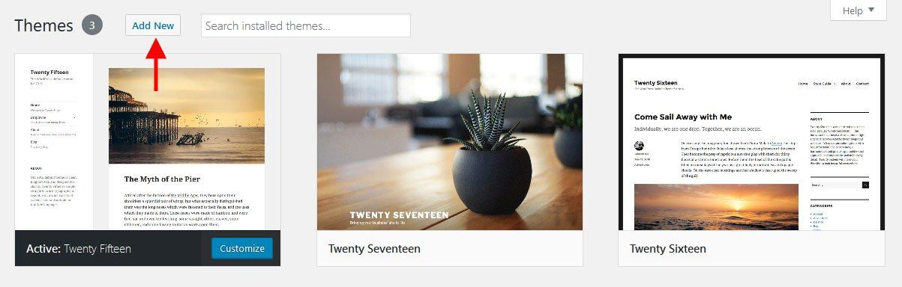
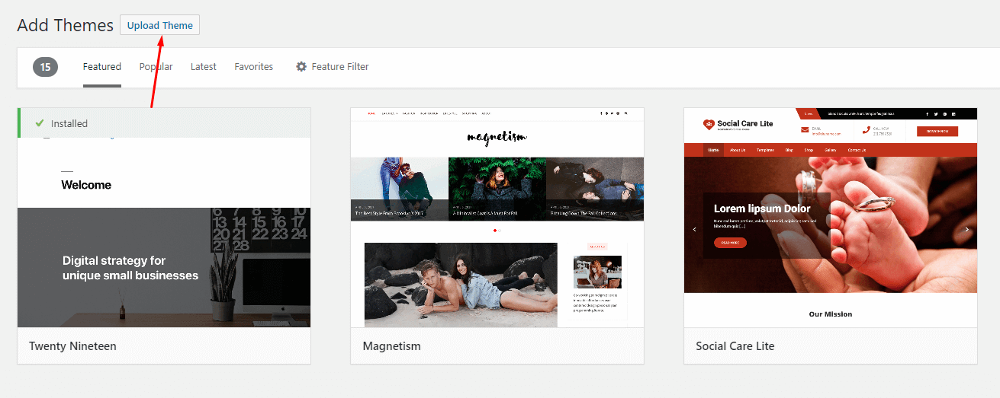
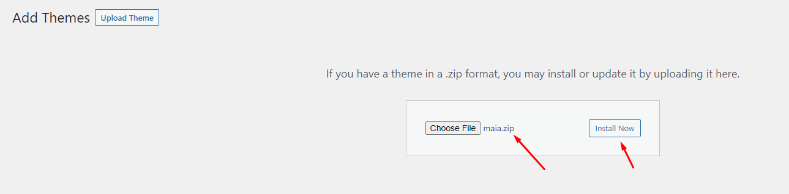
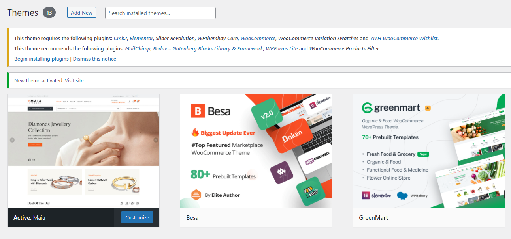

# Theme Installation via WordPress


Please, follow the steps below to install Maia Theme (Make sure you had extracted files).


* Step 1 – Login to your **WordPress Dashboard**.
* Step 2 – Navigate to **Appearance ► Themes**.
* Step 3 – Click **Add New** button on top of the page.

* Step 4 – Then click **Upload Theme**

* Step 5 – Next, **Browse** to the zip file and click **Install now** for the theme to be uploaded and installed.

* Step 6 – After done installing, click **Activate** the theme

