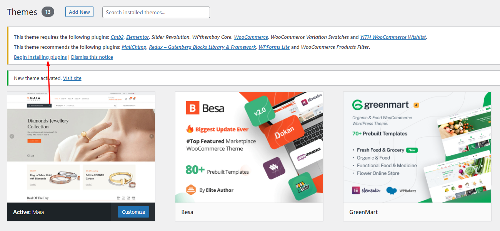
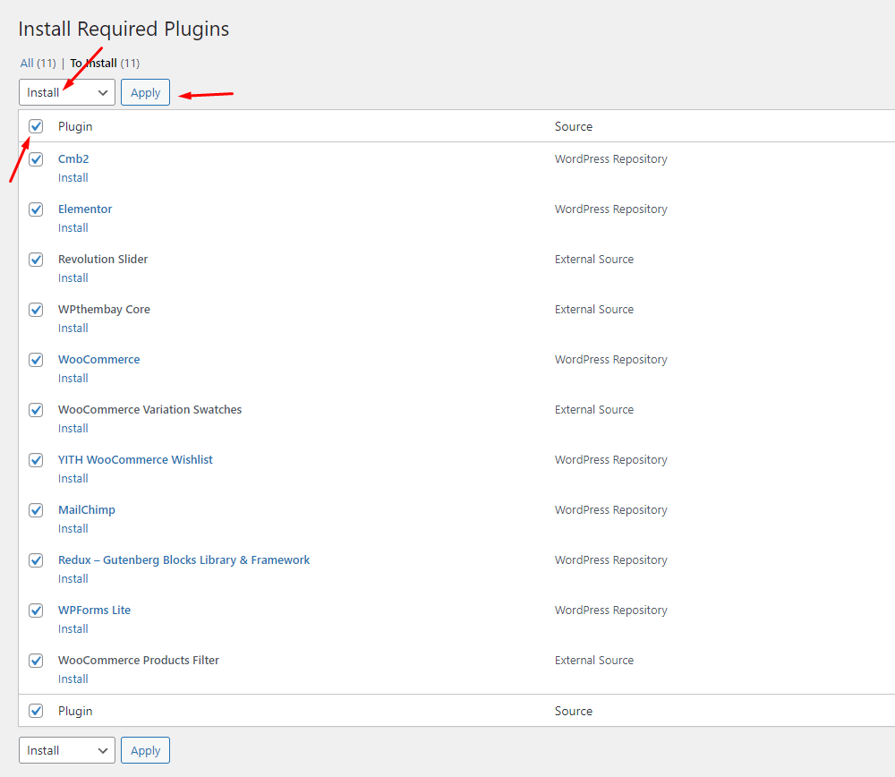
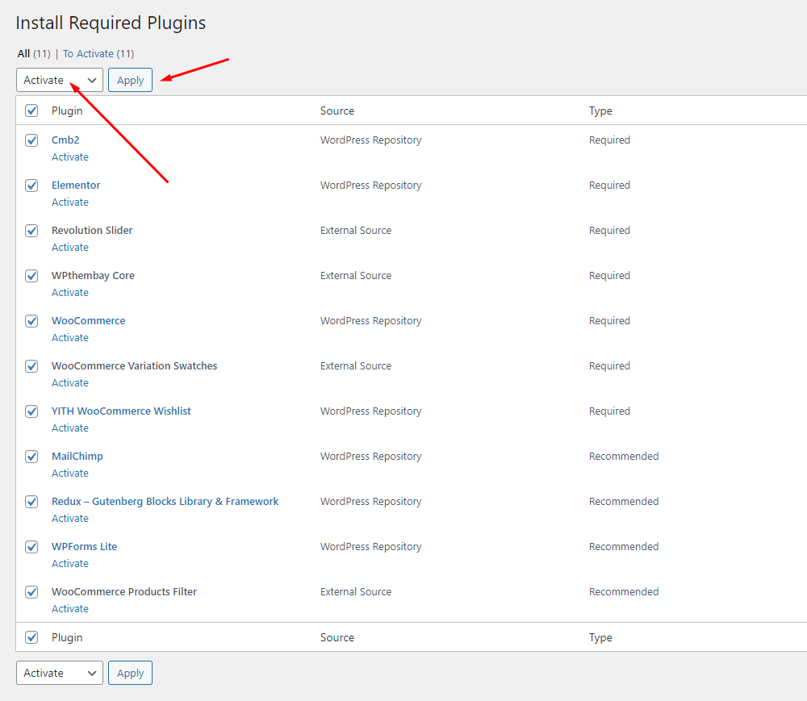

# Installation Plugins


#### Please, follow the steps below to install the required plugins:


* Step 1 - After activating the theme, you will be asked to install the required and recommended plugins, you can proceed by clicking on **Begin installing plugins**

* Step 2 – On the next page, check all the plugins that you want to install then on the drop-down **Bulk Actions**, choose to **Install** then click **Install**, the plugin installation process will start.\

* Step 3 – Check all the plugins that you want to activate then on the drop-down **Bulk Actions**, choose to **Activate,** and click **Apply**, the plugin installation process will start. Wait for all the plugins activated then you can start customizing your website as you wish


