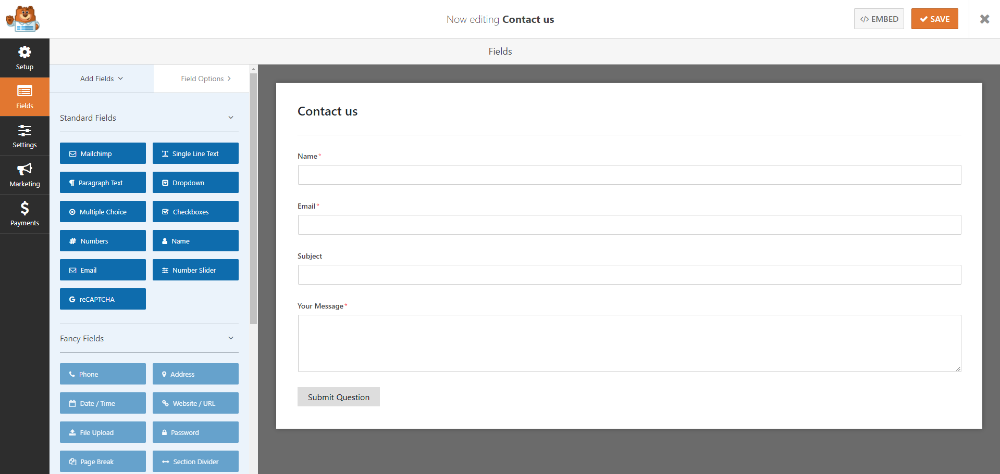
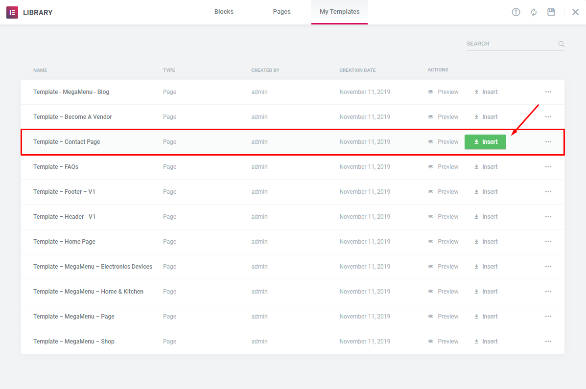

# Contact Page

### <mark style="color:purple;">**1. Create Contact Form.**</mark>

Use this plugin to make the contact form on the contact page. Navigate to **WPForms - All Forms**, there is a form named **Contact us**, if you want to create a new form, click on **Add New** button.

### <mark style="color:purple;">**2 Create Contact Page**</mark>

* **Step 1** - Log in to your WordPress Administration Panel (Dashboard)
* **Step 2** - Click on **Pages** > **Add New** > **Edit with Elementor**.
* **Step 3** - Click on the **Add Template**

* **Step 4** - Click on the **My Templates** > **Teamplate - Contact Page** > **Insert**.

* **Step 5** - Update / Publish your page
