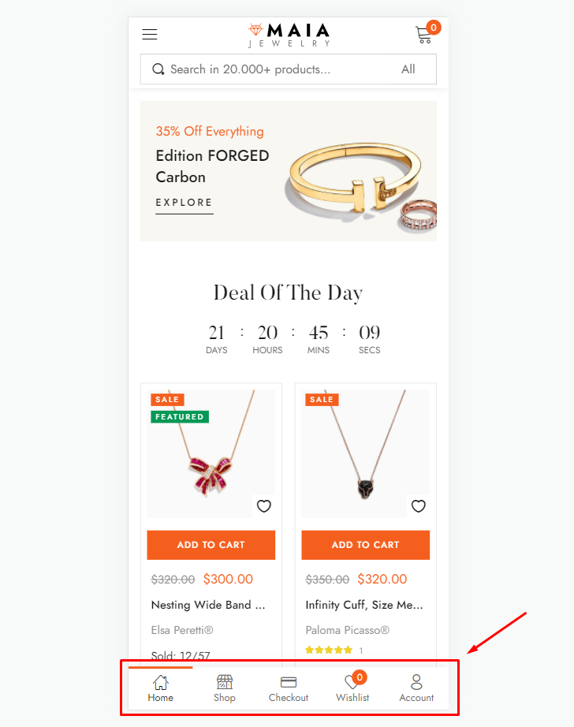
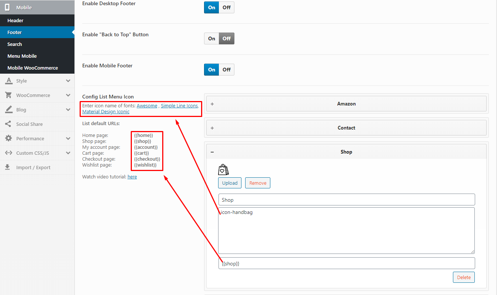

# Footer Mobile

### <mark style="color:purple;">**1. Create a new menu with "default URLs"**</mark>

1. **Icon Class Name**: Enter icon name of fonts: [Awesome](https://fontawesome.com/icons?m=free/), [Simple Line Icons](https://fonts.thembay.com/simple-line-icons/), [Material Design Iconic](https://fonts.thembay.com/material-design-iconic/)
2. **Link**: List default URLs:
   * **Home page**: `{{home}}`
   * **Shop page**: `{{shop}}`
   * **My account page**: `{{account}}`
   * **Cart page**: `{{cart}}`
   * **Wishlist page**: `{{wishlist}}`

### **2. Create a new menu with "Custom Links"**
