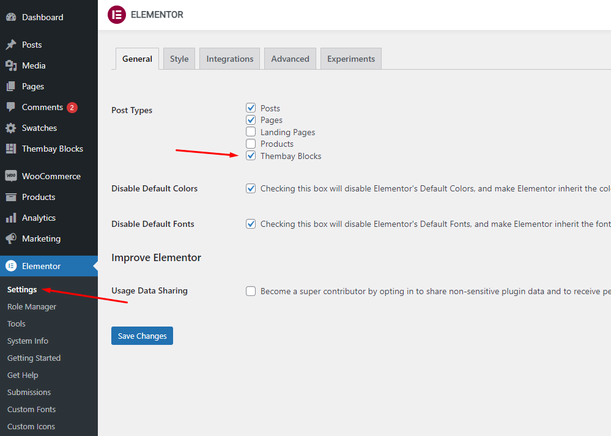
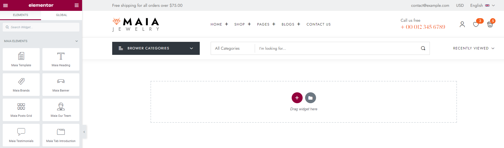
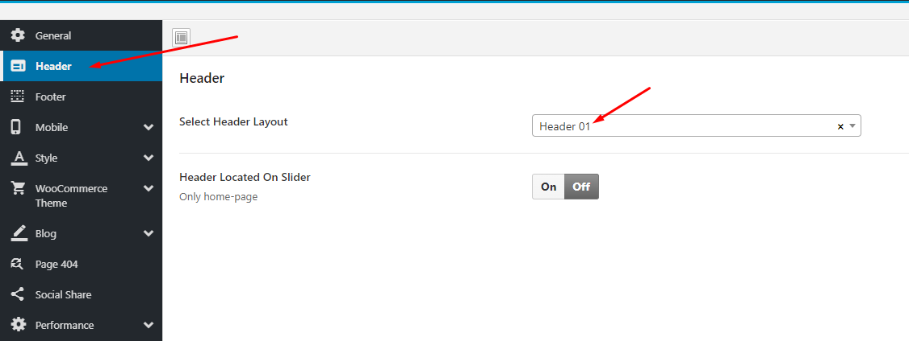

# Header Builder Elementor

* **Step 1** Enable Elementor for Thembay Blocks

* **Step 2** Choose Thembay Blocks > Add New > Type of Template = Header

.png>)

* **Step 3** - Build your header style with an unlimited layout

.png>)

* **Step 4** - After creating your Header. Choose the header for the website in **Theme Options**.\

