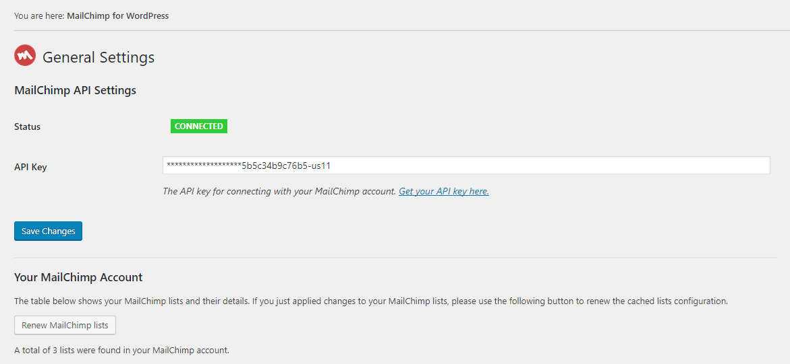
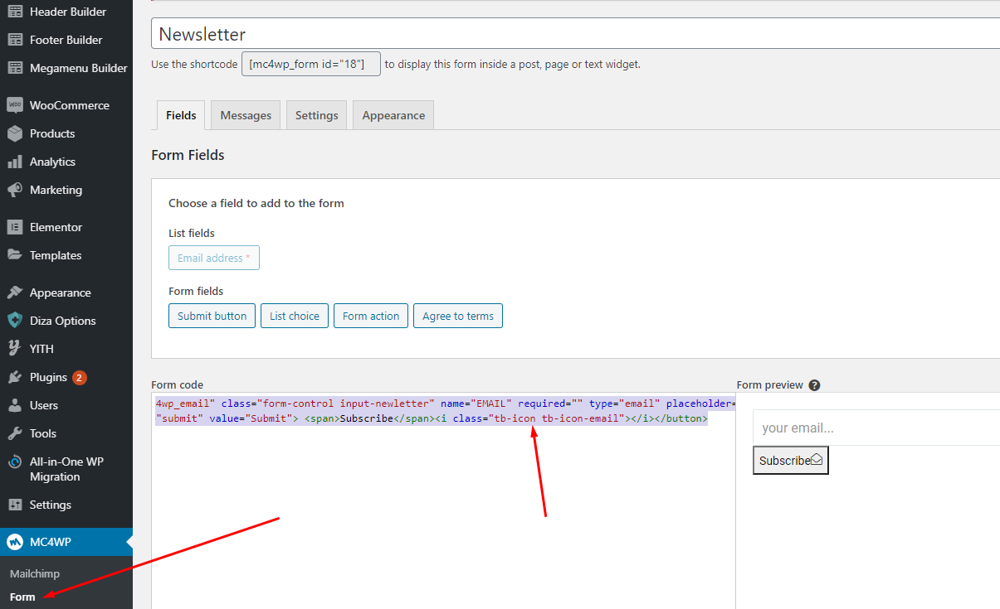

# MailChimp

### <mark style="color:purple;">**1. MailChimp API**</mark>

The API key for connecting with your MailChimp account. [Get your API key here.](https://us11.admin.mailchimp.com/account/api/)



### <mark style="color:purple;">**2. Form**</mark>

```
<input class="form-control input-newletter mc4wp_email" name="EMAIL" required="" type="email" placeholder="Email address"> 
<button type="submit" value="Submit"> Subscribe <i class="tb-icon tb-icon-send"></i> </button>
```




**Watch the video tutorial here:**



