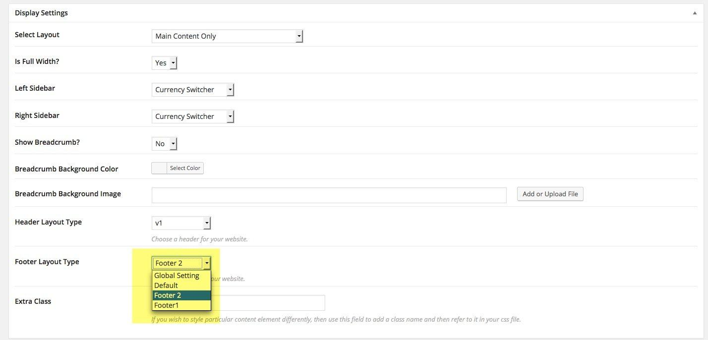

# Set Up Footer

* **Step 1** Enable Elementor for Thembay Blocks

* **Step 2** Choose Thembay Blocks > Add New > Type of Template = Footer

* **Step 3** - Build your Footer style with unlimited layout

* **Step 4** - After creating your footer. Choose the Footer for the website in **Theme Options**.


If you want a specific Footer for one of your pages. Please go to your page configuration. Select the Footer version you want to display only on that page.


