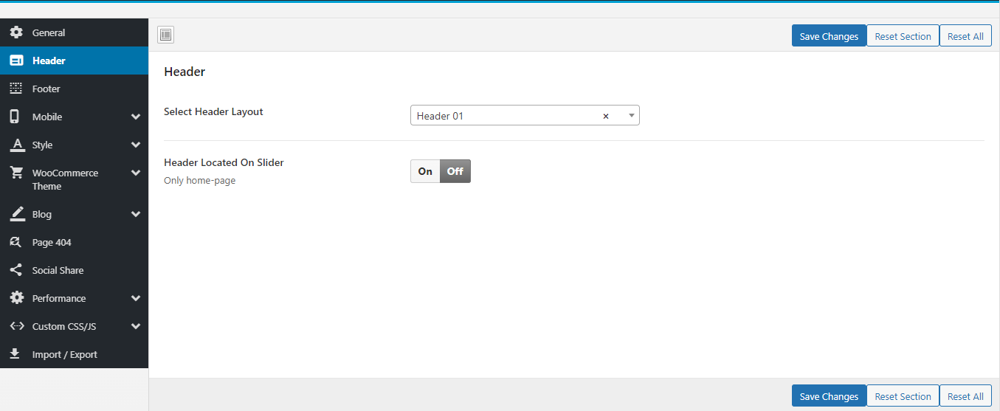
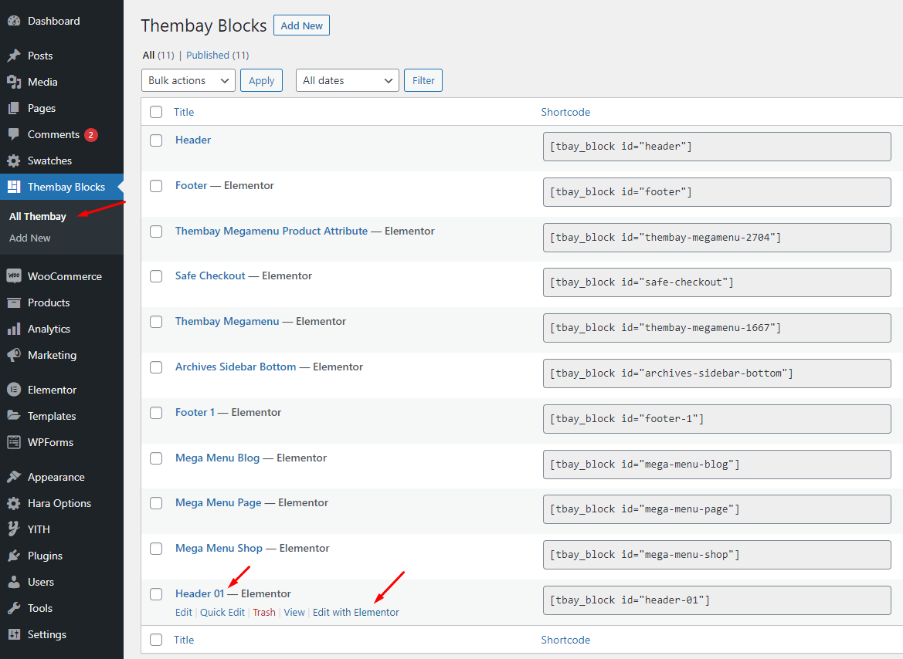
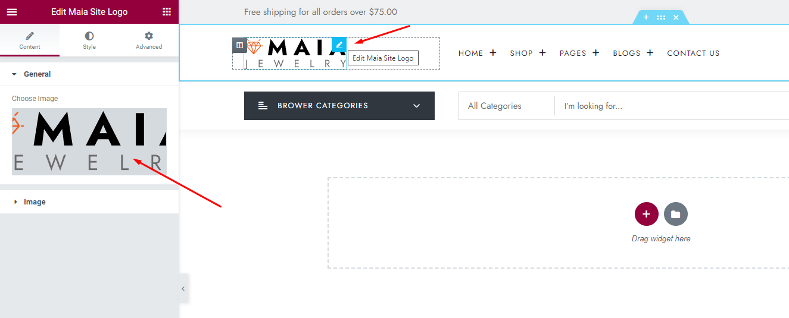
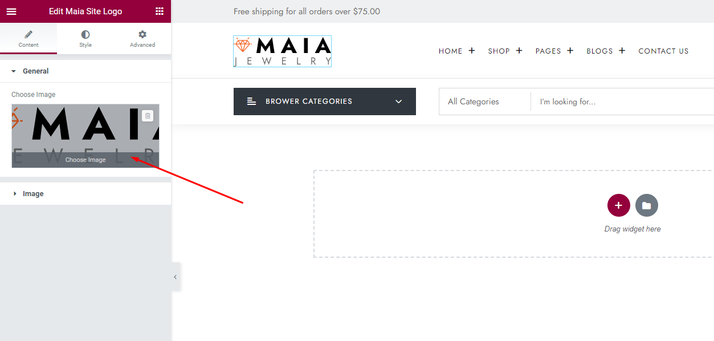

# Header Builder

**Upload logo in Elementor Header Builder (Select Header Layout = Header Builder)**

* **Step 1** - Select Header Layout = Header Builder

* **Step 2** - Go to **Thembay Blocks** > **Edit with Elementor**

* **Step 3** - Choose **Custom Logo**

* **Step 4** - Choose Mobile Logo here:

.png>)
