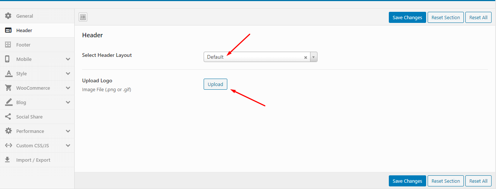
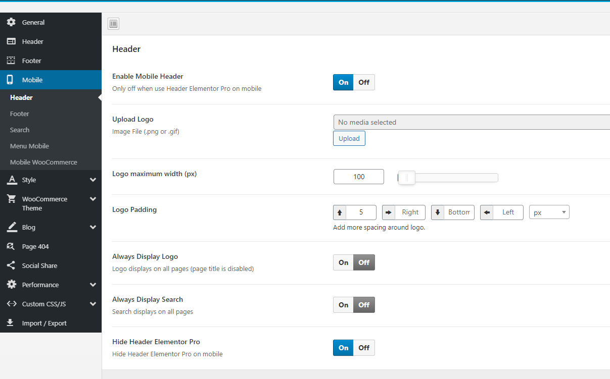

# Theme Options

**Upload logo in Theme Options (Select Header Layout = Default)**

* **Step 1** - Login to your WordPress Dashboard.
* **Step 2** - Go to **Maia Options** > **Header**
* **Step 3** - Upload your logo by clicking on Select Image (our current Maia logo is 171x54px)

* **Step 4** - Choose Mobile Logo here:

