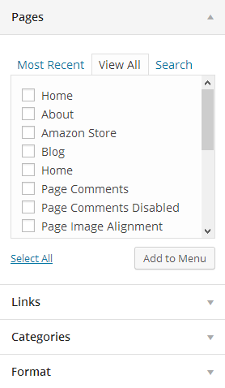

# Set Up Menu

### <mark style="color:purple;">**1. Creating your menu**</mark>

* **Step 1-** Login to the WordPress Dashboard.
* **Step 2-** From the 'Appearance' menu on the left-hand side of the Dashboard, select the 'Menus' option to bring up the Menu Editor.

* **Step 3 -** Select Create a new menu at the top of the page.
* **Step 4 -** Enter a name for your new menu in the Menu Name box.
* **Step 5 -** Click the Create Menu button. Your menu is now defined, and you can now add pages to it (steps below).

### <mark style="color:purple;">**2. Adding pages to your menu**</mark>

* **Step 1** - Locate the pane entitled Pages.
* **Step 2** - Within this pane, select the View All link to bring up a list of all the currently published Pages on your site.&#x20;
* **Step 3** - Select the Pages that you want to add by clicking the check box next to each Page's title.
* **Step 4** - Click the Add to Menu button located at the bottom of this pane to add your selection(s) to the menu that you created in the previous step.
* **Step 5** - Click the Save Menu button once you've added all the menu items you want. Your custom menu has now been saved.


The Screen Options allow you to choose which items you can use to add to a menu. Certain items, like Posts or Products, are hidden by default. The Screen Options are located in the top right corner of your WordPress Dashboard.


### <mark style="color:purple;">**3. Assigning a Menu to a Location**</mark>

Once you've created a menu and filled it with items, it's time to assign it to one of the theme pre-defined locations.

\- Go to **Appearance > Menus** and click **Manage Locations.**

The menu is assigned after import data by "One click import".

### <mark style="color:purple;">**4. Configure Mega Menu**</mark>


Please follow this video:



