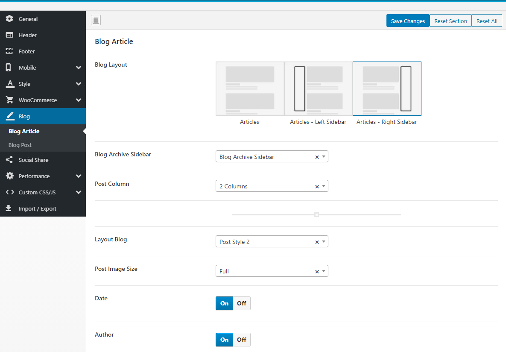

# Blog

### <mark style="color:purple;">**1. Breadcrumb Blog**</mark>

### <mark style="color:purple;">2.</mark> <mark style="color:purple;"></mark><mark style="color:purple;">**Blog Article**</mark>

### <mark style="color:purple;">**3. Blog Post**</mark>

