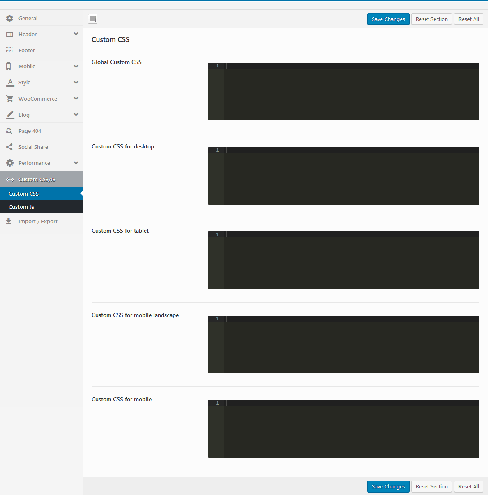
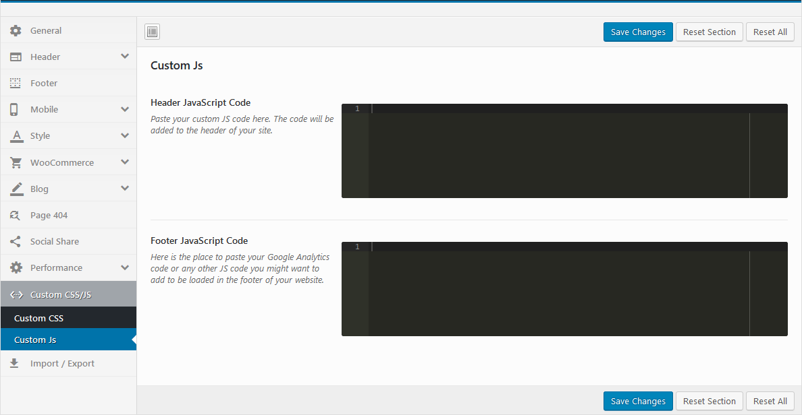

# Custom CSS/JS

### <mark style="color:purple;">1.</mark> <mark style="color:purple;"></mark><mark style="color:purple;">**Custom CSS**</mark>

### <mark style="color:purple;">**2. Custom JS**</mark>


**Watch the "Custom CSS/JS" video tutorial:**



