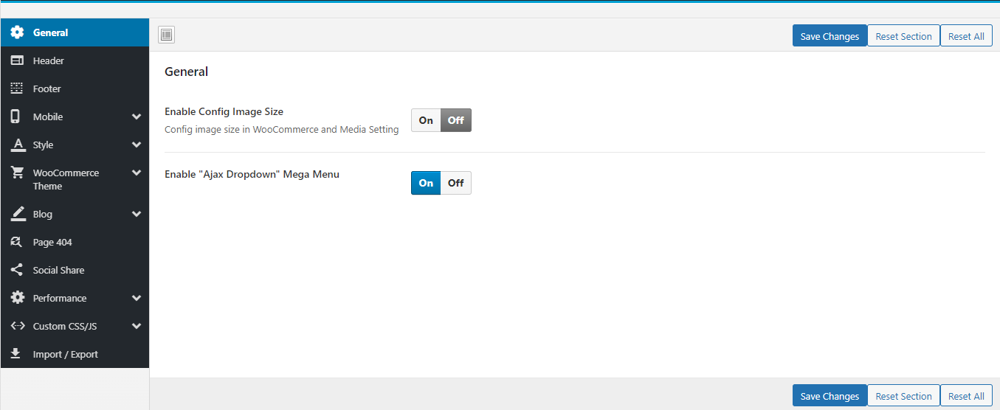
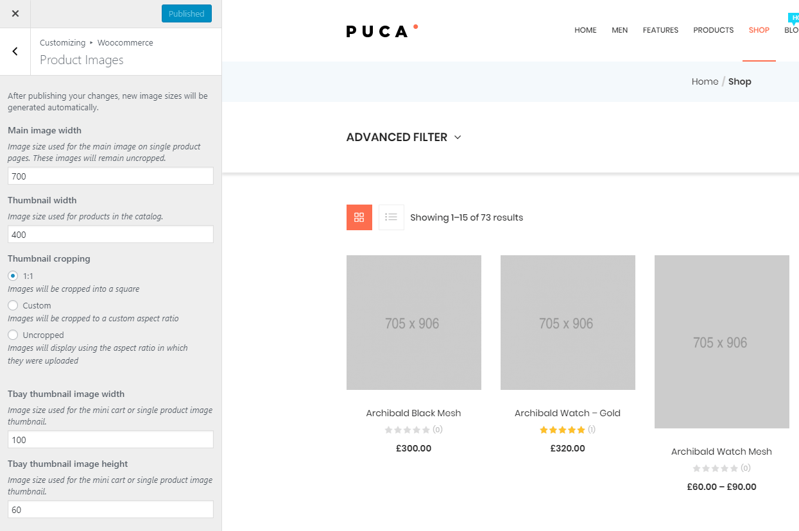

# General

**Maia Theme** uses Customizer provides an ultra-effective and intuitive way to customize theme layout & setting with real-time preview. Bring all of the settings to the customizer, you do not need to use another theme option anymore

**- Enable Config Image Size**: Turn on this function then customize the image size here: **Appearance > Customize > WooCommerce > Product Images**

