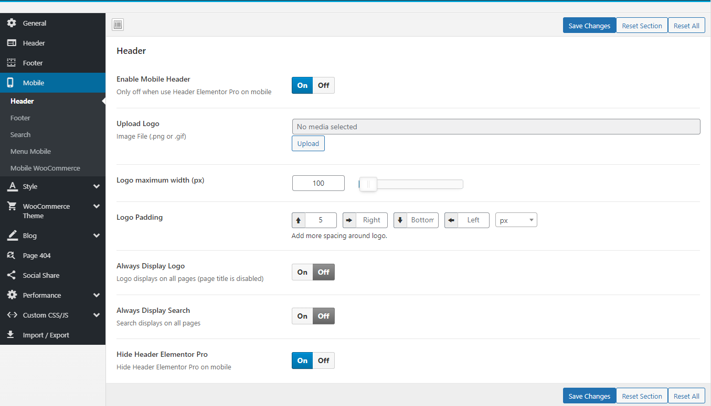
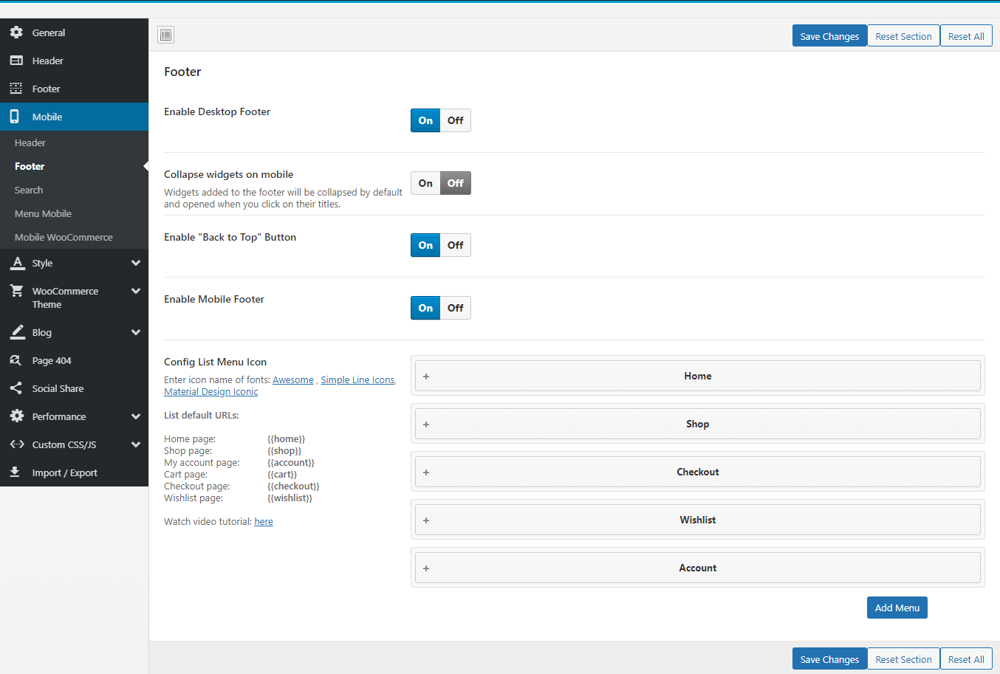
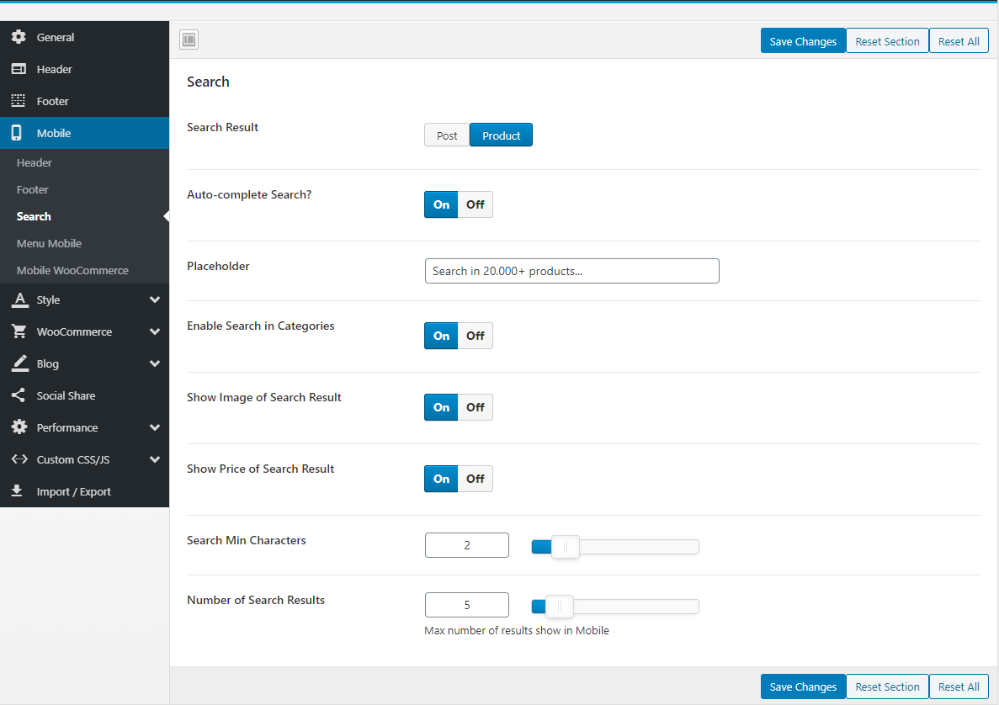
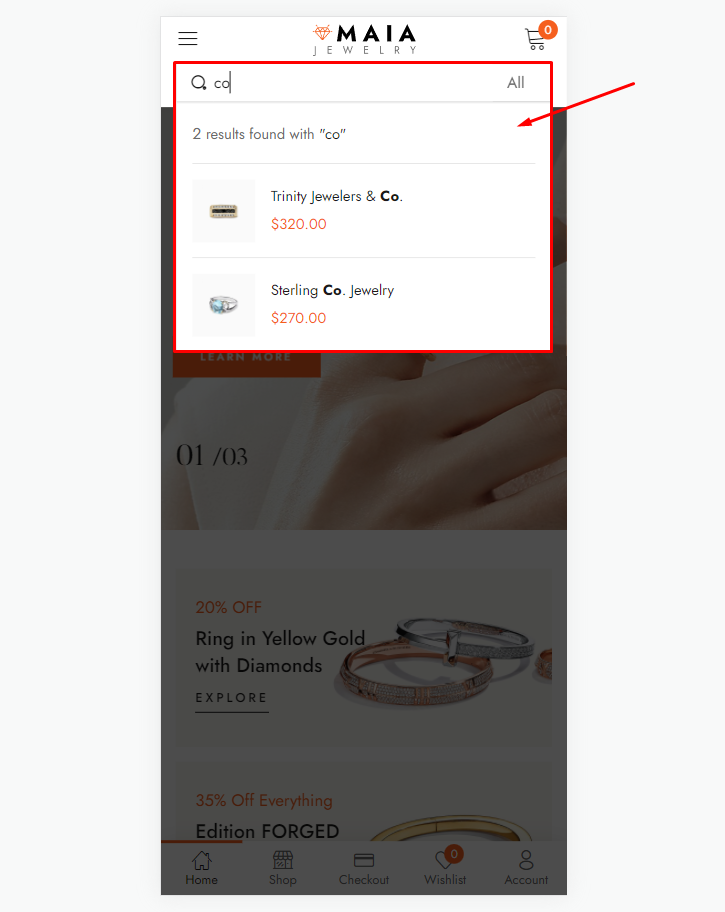
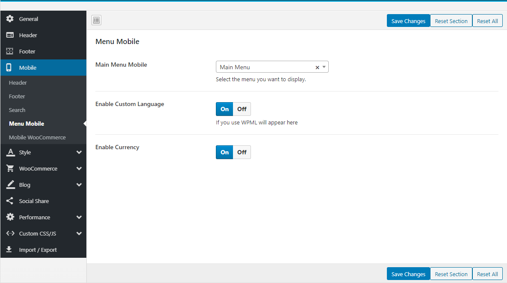
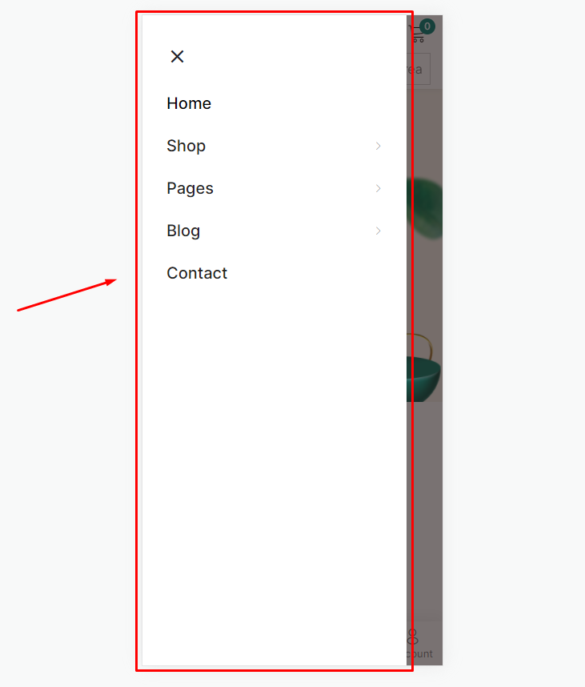
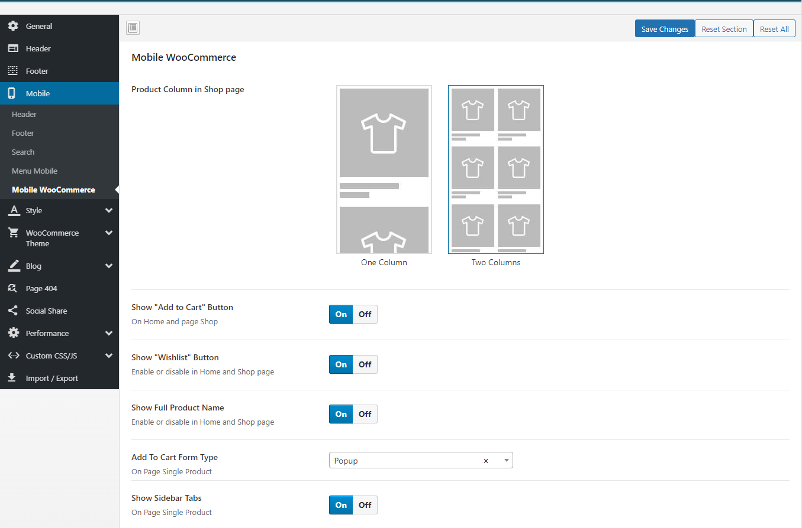
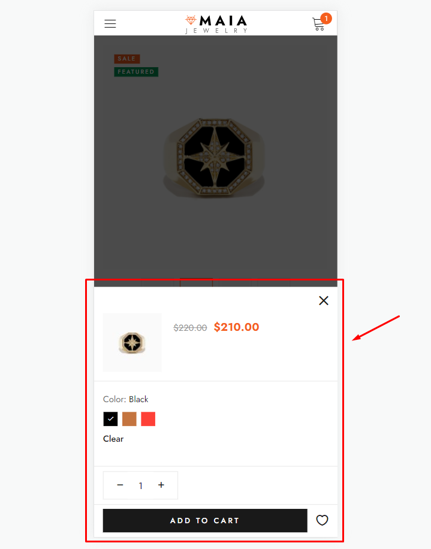
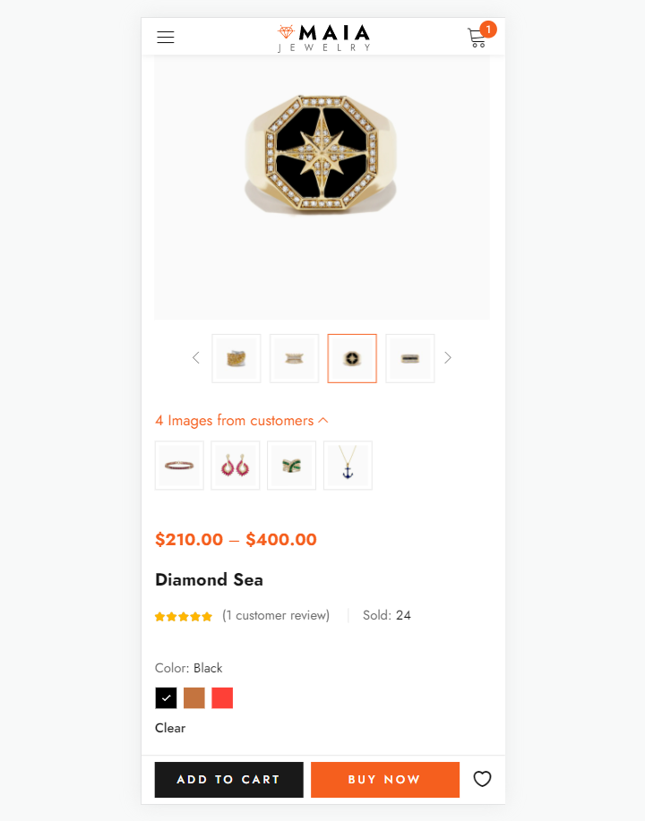

# Mobile

Upload Mobile Logo, Hidden Footer Mobile, and config number of products in a row on mobile.

### <mark style="color:purple;">**1. Mobile Header**</mark>

* **Enable Mobile Header**: Only off when using Header Elementor Pro on mobile
* **Upload Mobile Logo**: Upload your logo for mobile devices
* **Always Display Logo**: Logo displays on all pages (page title is disabled)
* **Always Display Search**: Search displays on all pages
* **Hide Header Elementor Pro**: Hide Header Elementor Pro on mobile

### <mark style="color:purple;">2. Mobile Footer</mark>

* **Enable Desktop Footer**: Show/Hide Desktop Footer in Mobile
* **Collapse widgets on mobile**: Widgets added to the footer will be collapsed by default and opened when you click on their titles.
* **Enable "Back to Top" Button**: Show/Hide "Back to Top" Button
* **Enable Mobile Footer**

* **Config List Menu Icon**


****[**See more instructions about "Customize Footer Mobile" here**](../theme-configuration/footer-mobile.md)****


### <mark style="color:purple;">3.</mark> <mark style="color:purple;"></mark><mark style="color:purple;">**Search Mobile**</mark>

### <mark style="color:purple;">4.</mark> <mark style="color:purple;"></mark><mark style="color:purple;">**Mobile Menu**</mark>

### <mark style="color:purple;">5.</mark> <mark style="color:purple;"></mark><mark style="color:purple;">**Mobile WooCommerce**</mark>

* **Product Column in Shop page**: You can choose to show one or two products per line on the mobile
* **Show "Add to Cart" Button**: Enable or disable in Home and Shop page
* **Show "Wishlist" Button**: Enable or disable in Home and Shop page
* **Show Full Product Name**: Show full name or only one line on Home and Shop page
* **Add To Cart Form Type (HOT Feature)**: This is the most prominent feature on mobile. Help you experience the purchase feature like on a professional sales APP












**Watch the video tutorial here:**



