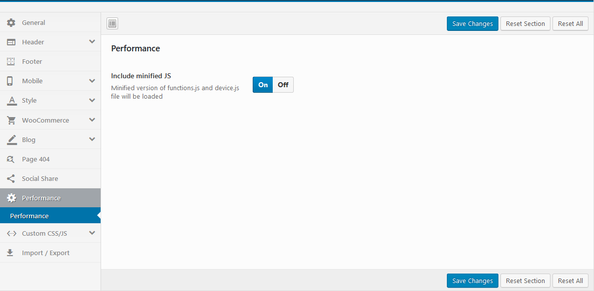

# Performance

Speed ​​up the website: Minified version of functions.js and device.js file will be loaded

* **Yes**: The Minified JS file will be loaded, eg: **maia\js\functions.min.js**
* **No**: The normal JS file will be loaded, eg: **maia\js\functions.js**

### **Preload Website**: Choose a Preloader Image for your website.


**Watch the video "Choose a Preloader Images for your website" tutorial:**





**Watch the video "Custom Preloader with your logo" tutorial:**



