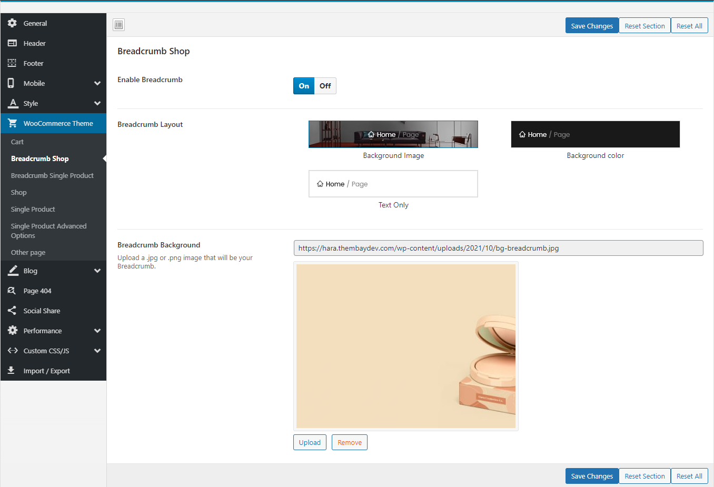

# WooCommerce

Manage global setting for WooCommerce

* **Label Sale Format**: Optional "Sale label" format as you want
* **"Featured" Label**: Optional "Featured" format as you want
* **Enable Brand Name**: Enable/Disable brand name on HomePage and Shop Page
* **Enable the text of Time Countdown**

* **Product Image Display Mode**: Select the type of image display you want
* **Enable Quick View**: Enable/Disable Quick View
* **Show WooCommerce Catalog Mode**: Enable/Disable WooCommerce Catalog Mode (Hide "Add to Cart", "Mini-Cart")
* **Enable WooCommerce Quantity Mode**: Enable/Disable show quantity on Home Page and Shop Page
* **Quantity Ajax Auto-update**: Enable/Disable quantity ajax auto-update on page Cart
* **Enable Product Variation Swatch**: Enable/Disable Product Variation Swatch on HomePage and Shop page
* **Product Attribute**: Select an attribute that you display on the product on the home page and the Store page

### <mark style="color:purple;">1. Mini Cart</mark>

Configure properties for Mini cart

* **Enable Free Shipping on Cart and Mini-Cart**

.png>)

* **Enable Quantity on Mini-Cart**: Help buyers increase or decrease the quantity right on the mini-cart

* **Mini-Cart Position**: Select the display styles of the mini-cart you want: Left, Right, Popup, None Popup

### <mark style="color:purple;">2. Breadcrumb Shop</mark>

Configure properties for Breadcrumb Shop page

### <mark style="color:purple;">3. Breadcrumb Single Product</mark>

Configure properties for Breadcrumb Single Product page

### <mark style="color:purple;">4. Shop</mark>

Configure properties for Shop

### <mark style="color:purple;">5. Single product</mark>

Configure properties for a Single product

### <mark style="color:purple;">6. Single Product Advanced Options</mark>

Configure properties for Single Product Advanced

### <mark style="color:purple;">7. Other Pages</mark>

