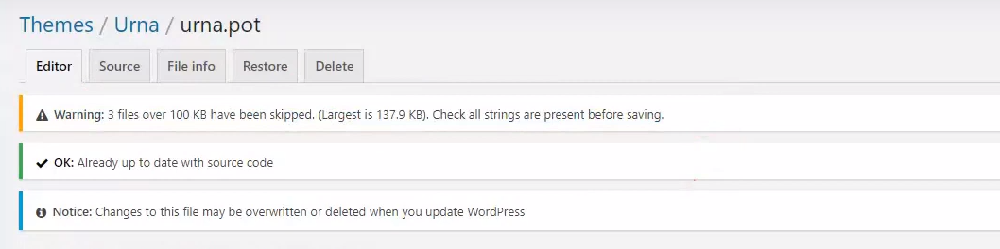
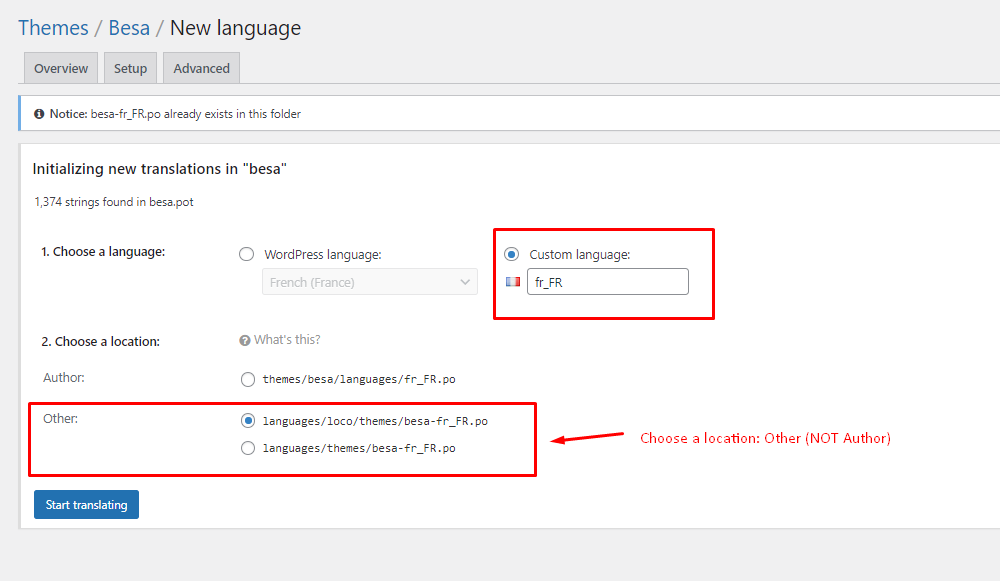
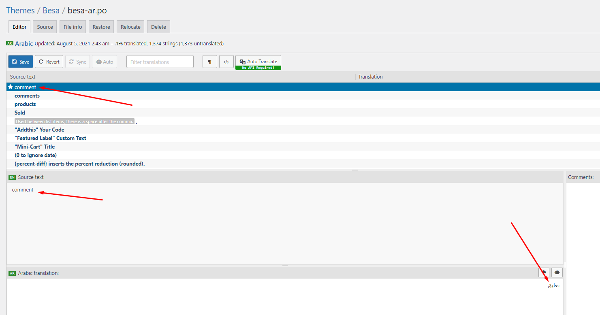
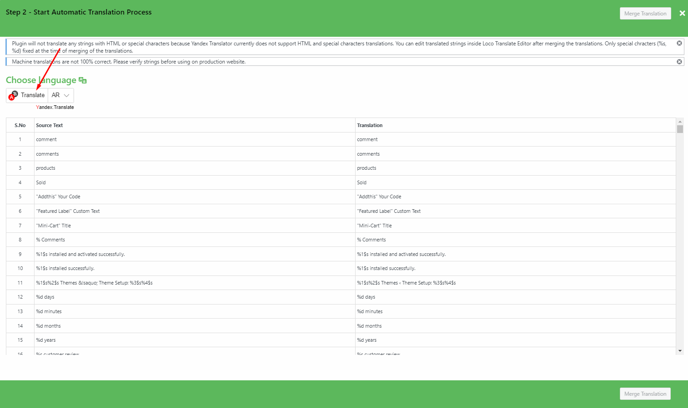
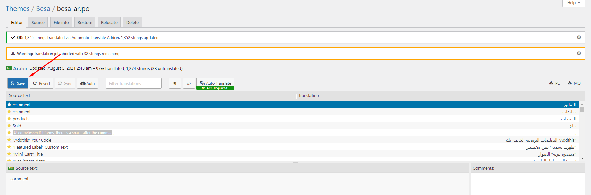

# Loco Translate

Loco Translate provides in-browser editing of WordPress translation files.

It also provides localization tools for developers, such as extracting strings and generating templates.


**Watch the "Loco Translate" video tutorial:**




### <mark style="color:purple;">**1. Install the plugin "Loco Translate"**</mark>

### <mark style="color:purple;">**2. Update Language Template**</mark>


"Loco Translate - Warning: files over 100 KB have been skipped". If you have problems above, follow the following video tutorial to fix that.



**Watch the video tutorial here:**




### <mark style="color:purple;">**3. Create your language > Choose a location: Other (NOT Author)**</mark>

### <mark style="color:purple;">**4. Manual translation: You will manually translate each text**</mark>

### **5. Automatic Translate: Install the plugin "Automatic Translate Addon For Loco Translate"**

### **6. Some text need edit in Theme Options**

\
