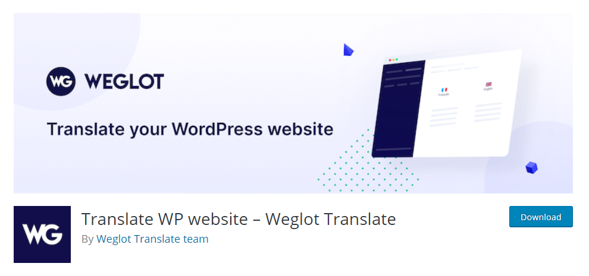

# Weglot Translate


To use this function, you need to install the plugin [https://wordpress.org/plugins/weglot/](https://wordpress.org/plugins/weglot/)


**Weglot Translate is the best and easiest translation plugin to translate your WordPress website and go multilingual.**


**Watch the video tutorial here:**



