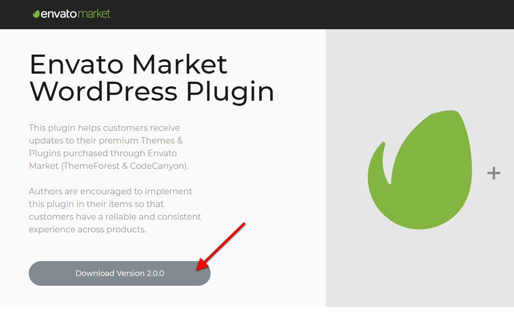
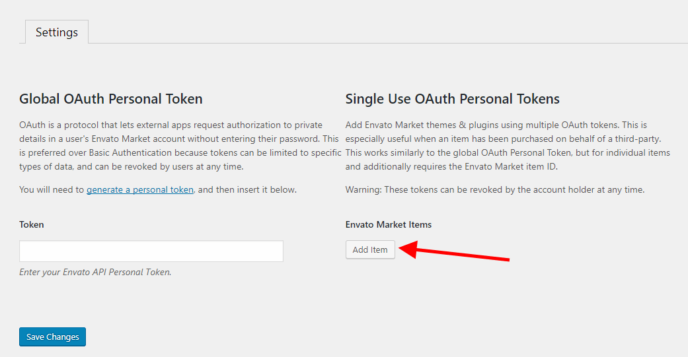
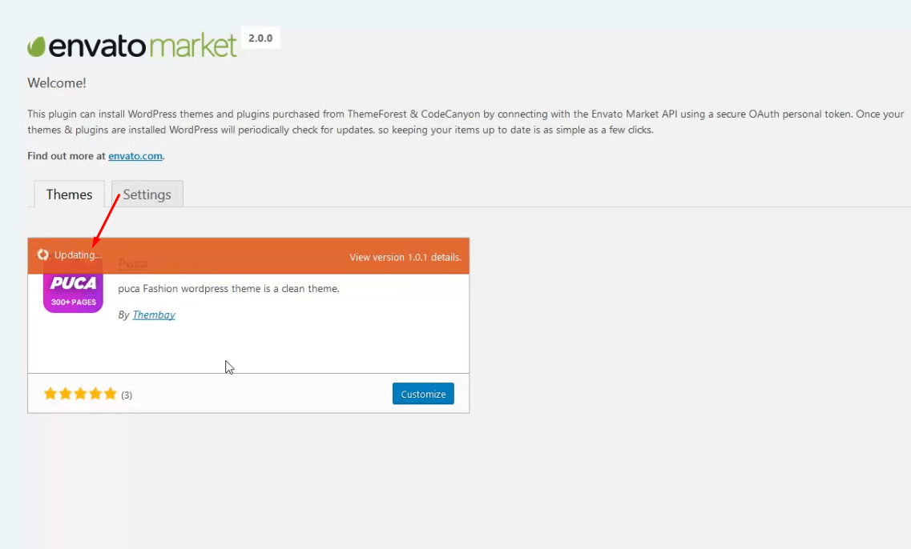

# ⏰ Update Maia Theme

### <mark style="color:purple;">Method 1. Use the plugin "Envato Market" plugin</mark>

**You need to follow these steps to perform the update:**

* **Step 1. Download** the Envato Market plugin and install it through the WordPress Dashboard: [Click here to download](https://envato.com/market-plugin/)

* **Step 2. Activate the plugin.**
* **Step 3. Login and Create Token** here [https://build.envato.com/my-apps/#tokens](https://build.envato.com/my-apps/#tokens)

* **Step 4. Envato Market Items**

* **Step 5. Update the Theme**


**Watch the video tutorial here:**




### <mark style="color:purple;">Method 2. Manually Install the Update</mark>


This method requires more steps and manual work. First, you need to manually download the new theme package from your ThemeForest account. Once you have the new theme package, you can choose to upload the theme via WordPress or via FTP. Please see the information below for how to download new files, and install them via WordPress or via FTP.


**How To Receive Free Support**

* **Step 1** – Log into your ThemeForest account and navigate to your Downloads tab. Find the Maia theme purchase.
* **Step 2** – Click the Download button next to it and either choose to download the Installable WordPress Theme, which is just the WordPress file, or choose to download the Main Files which is the entire package that contains everything.
* **Step 3** – After downloading the files, you need to decide if you want to install the update via FTP or via WordPress. For directions on both methods, please continue reading below.

**How To Update Your Theme Via FTP**

* **Step 1** – Go to **wp-content > themes** folder location and backup your Maia theme folder by saving it to your computer, or you can choose to simply delete it. Your content **will not** be lost.
* **Step 2** – Retrieve the **maia.zip** file from your new ThemeForest download and extract the file to get the updated Maia theme folder.
* **Step 3** – After extracting the updated Maia theme folder, simply drag and drop the new Maia theme folder into **wp-content > themes** folder location. Choose to Replace the current one if you did not delete the old Maia theme folder
* **Step 4** – Lastly, update the included plugins. You will see a notification message letting you know a new version of the plugins are available and need to be updated. Follow the onscreen prompts to update the plugins


If you upgrade through FTP, please visit your WP-admin so any new theme options can be registered. If you do not do this and also have wp-debug turned on, you may see PHP notices on the front end. They will disappear once you visit the WP admin.


**How To Update Your Theme Via WordPress**

* **Step 1** – You need to deactivate the current maia theme located in the **Appearance > Themes** section by activating a different theme. Once you activate a different theme, you can delete the maia theme. Dont worry, your content **will not** be lost.
* **Step 2** – Retrieve the new **maia.zip** file from your ThemeForest download. If you downloaded the Main Files from ThemeForest, you need to unzip the archive file you received to get the maia.zip file inside.
* **Step 3** – Upload the **maia.zip** file to the **Appearance > Themes** section by clicking on the “Install Themes” tab at the top and then choosing to upload the zip file.
* **Step 4** – Once it finishes uploading, choose to activate the theme.
* **Step 5** – Lastly, update the included plugins. You will see a notification message letting you know a new version of the plugins are available and need to be updated. Follow the onscreen prompts to update the plugins
