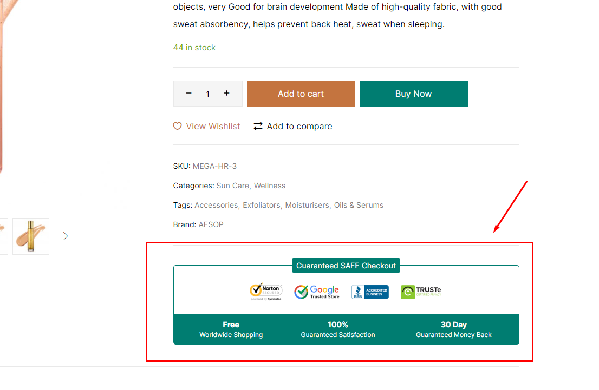
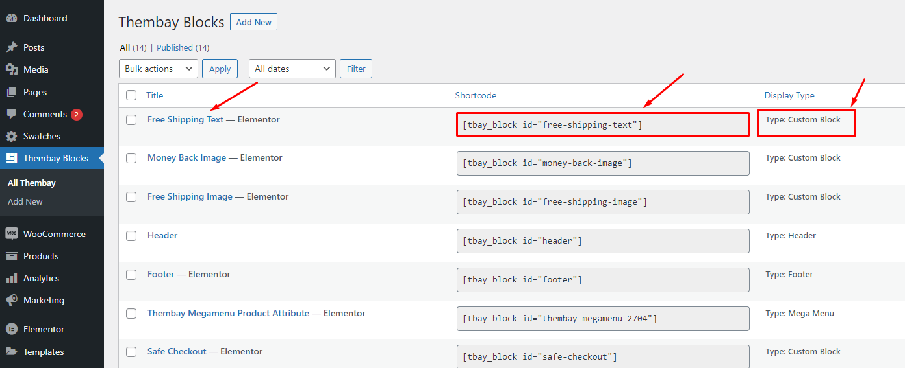
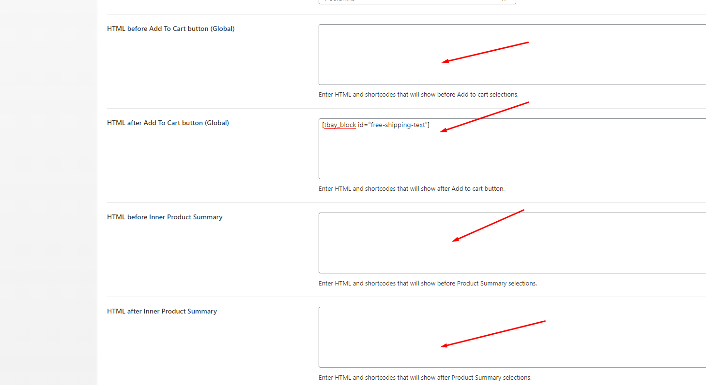

# Custom fields


#### How to add custom fields to a WooCommerce product? Free Shipping, 100% Money-back guarantee 



**Enter HTML and shortcodes that will show before/after Add to cart selections and before/after Inner Product Summary, eg: Free Shipping, 100% Money-back guarantee**


* [x] **Step 1: Create Thembay Blocks with Type: Custom Block. Edit content with Elementor. Then copy the Shortcode**

* [x] **Step 2: Paste that shortcode where you want it in Theme Options**


**Watch the video tutorial here:**



