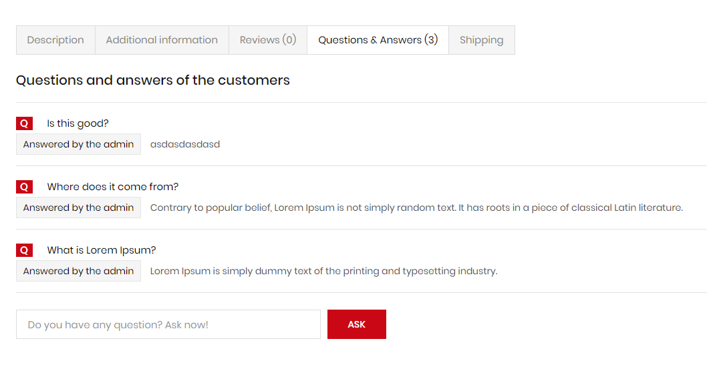
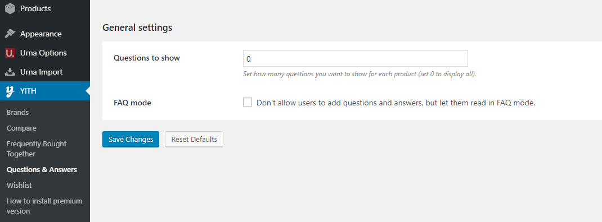

# Questions and answers


To use this function, you need to install the plugin [https://wordpress.org/plugins/yith-woocommerce-questions-and-answers/](https://wordpress.org/plugins/yith-woocommerce-questions-and-answers/)


**Configuration**

