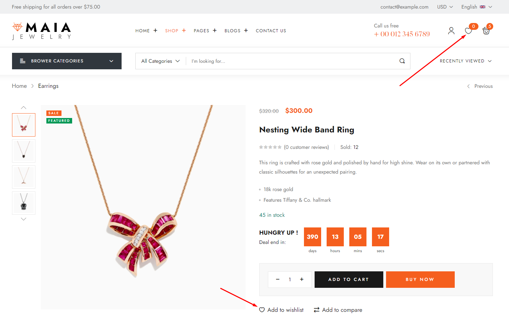
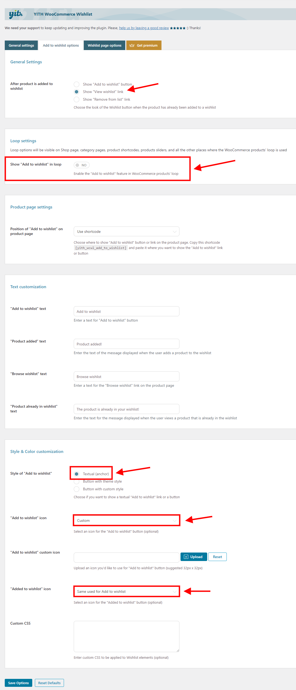

# YITH WooCommerce Wishlist


To use this function, you need to install the plugin [https://wordpress.org/plugins/yith-woocommerce-wishlist/](https://wordpress.org/plugins/yith-woocommerce-wishlist/)


**Add to Wishlist Options:**

